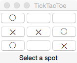

#Quick Tic-Tac-Toe

A graphical Tic-Tac-Toe client activated from the shell.
Uses Minimax artificial intelligence algorithm to replicate a human player.

### Dependencies
* Python 3
* Tkinter

### Acknowledgments
Thank you to [Juan Camilo Osorio](https://github.com/jcoc611) for working with me on earlier iterations of this project
